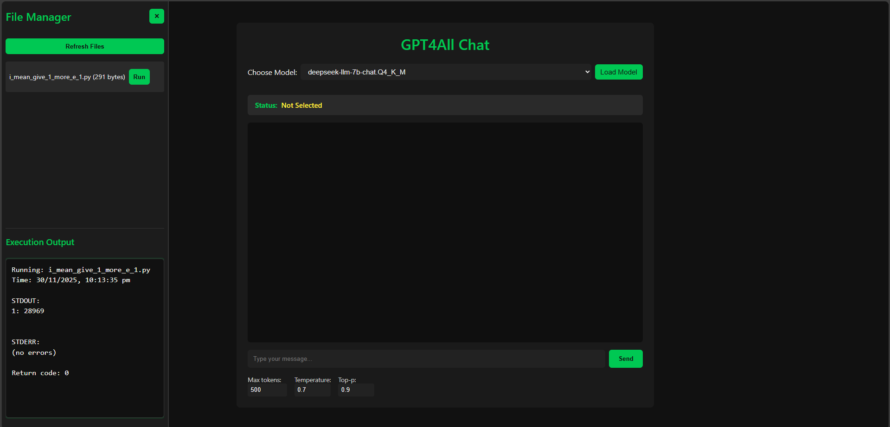

# Local AI Assistant

A simple Flask-based interface for running a local GPT4All model with streaming output.  
This project demonstrates how to deploy a local LLM, stream responses via Server-Sent Events (SSE), and automatically extract code blocks from generated text.

## Features
- Single global chat session with a system prompt
- SSE streaming with explicit `[PROCESSING]` and `[DONE]` markers
- Base64-encoded token streaming for safe client-side parsing
- Automatic code block extraction and saving to files
- JSON logging of generated code blocks (`generated_code.json`)
- Markdown-formatted responses for compatibility with `marked.js`

## Preview UI

This is the current UI rendered in a browser.

## Tech Stack
- **Backend:** Python, Flask
- **LLM Integration:** GPT4All (local deployment)
- **Streaming:** Server-Sent Events (SSE)
- **Regex + File I/O:** For code block extraction and saving

## Installation
Clone the repository and install dependencies:

```bash
git clone https://github.com/clashisharu/local-web-bot.git
cd local-web-bot
pip install -r requirements.txt
```